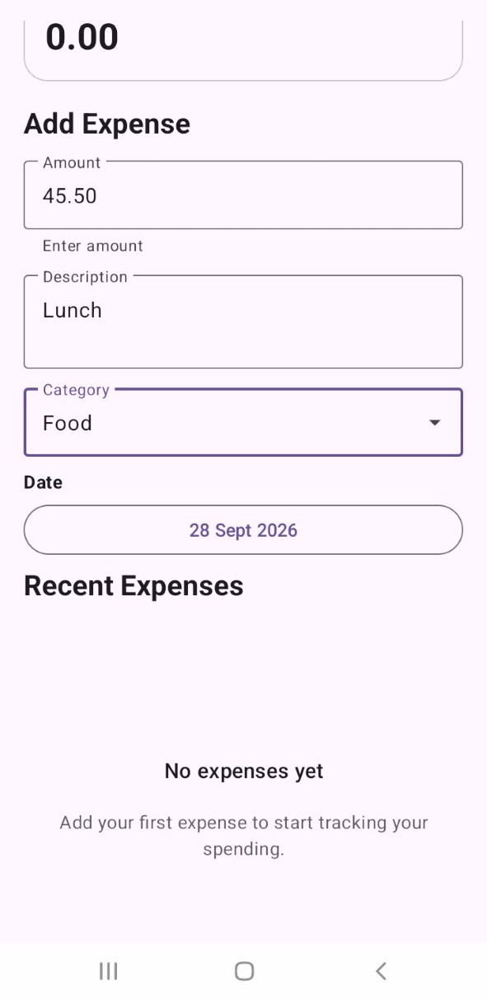
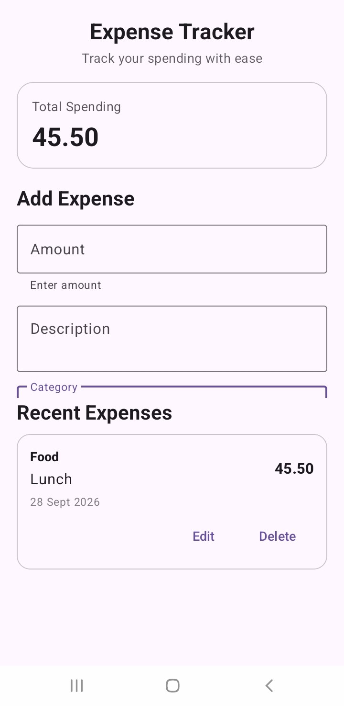
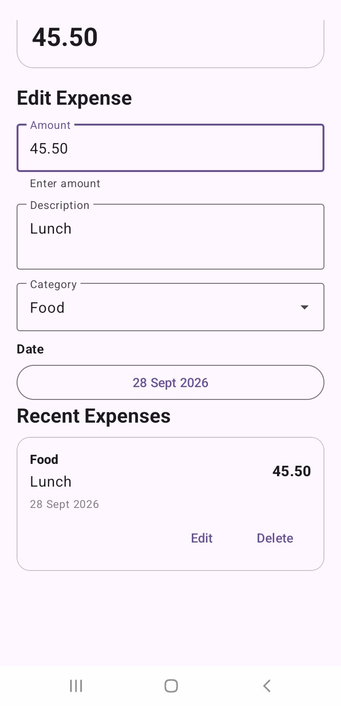
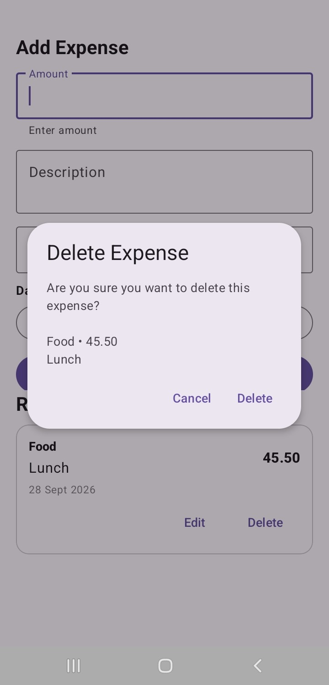

# Expense Tracker Android App

A Kotlin-based Android expense tracking application that allows users
to record, review, edit and delete personal expense records while
persisting data locally on the device.

## Features

- Add expenses
- Record expense amount
- Add expense descriptions
- Select expense categories
- Select expense dates
- View expense history
- Calculate total spending
- Edit existing expenses
- Delete expenses
- Delete confirmation dialog
- Input validation
- Empty-state handling
- Error handling
- Persistent local storage
- Responsive form layout
- Accessibility-conscious UI

## Categories

The application currently supports:

- Food
- Travel
- Shopping
- Bills
- Other

## Technologies Used

- Kotlin
- Android Studio
- XML
- Material Components
- Room
- SQLite
- KSP
- RecyclerView
- ViewModel
- Kotlin Coroutines
- Flow

## Architecture

The application uses a layered architecture:

UI
→ ViewModel
→ Repository
→ DAO
→ Room
→ SQLite

### Data Layer

- `Expense.kt` — database entity
- `ExpenseDao.kt` — database operations
- `ExpenseDatabase.kt` — Room database
- `ExpenseRepository.kt` — data access layer

### UI Layer

- `MainActivity.kt` — user interface coordination
- `ExpenseViewModel.kt` — UI state and database operations
- `ExpenseAdapter.kt` — RecyclerView data binding
- `ExpenseViewModelFactory.kt` — ViewModel construction

## Database

The application uses Room for local persistence.

Each expense contains:

- ID
- Amount
- Description
- Category
- Date

Monetary values are stored as minor currency units to avoid
floating-point precision issues.

## CRUD Operations

The application implements:

- Create — add an expense
- Read — display expense history
- Update — edit an expense
- Delete — delete an expense

## Testing

The application was tested for:

- Valid expense creation
- Empty amount
- Zero amount
- Negative amount
- Excess decimal places
- Empty description
- Invalid category
- Date selection
- Multiple expenses
- Total calculation
- Database persistence
- Editing expenses
- Cancelling edits
- Deleting expenses
- Cancelling deletion
- Confirming deletion
- Empty-state handling
- Persistence after application restart

## Screenshots

### Empty State

### Expense Form

### Expense Added

### Edit Mode

### Delete Confirmation

## Project Status

Task 2 of the Android Developer Internship completed.

## Author

Patrick Morrison
